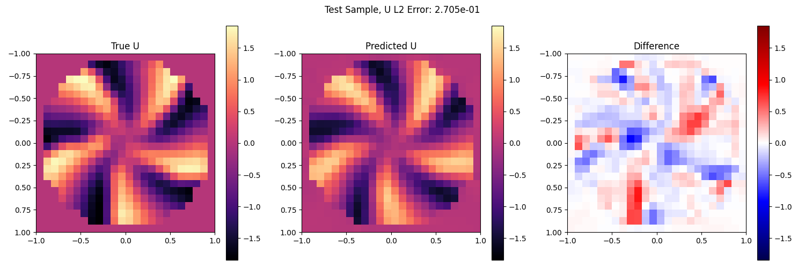
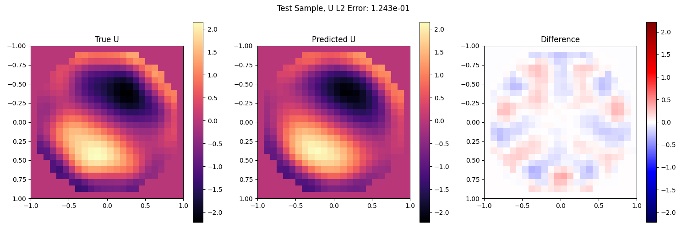

# Wavefront Reconstruction with DeepONet (JAX)

This repository contains a pipeline for generating synthetic wavefront data and training a DeepONet model to reconstruct wavefronts **U(x,y)** from measured gradients **(g1, g2)**.

---

## 📁 Repository Structure

```text
├─ models/
│   ├─ helpers.py        # Training utilities (losses, apply, step)
│   ├─ setup_deeponet.py # Model initialization/wiring
│   ├─ deeponet.py       # DeepONet model definition
│   └─ __init__.py       # Package exports
├─ requirements.txt      # Python dependencies
├─ Generator.py          # Data generation entry point
├─ Wavefront.py          # Training & evaluation entry point
├─ data/                 # Generated datasets
│   ├─ derivatives.npy   # Gradients (g1,g2), shape (N, P, 2)
│   └─ U_true.npy        # Ground-truth wavefronts, shape (N, P)
└─ results/              # Output directory
    └─ gradient_recon/
        └─ <run_folder>/ # Timestamped experiment folder
            ├─ ckpt/     # Model checkpoints (Orbax)
            ├─ log.xlsx  # Training logs (losses, weights, metrics)
            └─ vis/      # Visualizations (pred vs true, differences)
```
## 🚀 Quick Start
### 1) Install Dependencies
```bash
pip install -r requirements.txt
```
### 2) Generate Data (Required First Step)
Run the generator to create the dataset:
```bash
python Generator.py
```
This creates the data/ directory with:

data/derivatives.npy

data/U_true.npy

### 3) Train and Visualize
Run the training pipeline:
```bash
python Wavefront.py
```
This creates a new run folder at results/gradient_recon/<timestamp>/ containing:

checkpoints in ckpt/

training logs in log.xlsx

visualizations in vis/

## 🔬 Data & Model Overview
Each sample is defined on a square grid [-1, 1] × [-1, 1] with a unit-disk mask
(values outside the pupil are zeroed).

Input measurements: slope gradients

g1 = dU/dx

g2 = dU/dy

Network goal: reconstruct U at queried coordinates (x,y) from the full slope measurement vector.

Training combines:

ICS loss (supervised): matches predicted U (and optionally predicted g1, g2) to ground truth

Residual loss: enforces consistency between U and its derivatives via autodiff (dU/dx, dU/dy)

Residual weight adaptation (NTK-style): balances training speeds using a gradient norm ratio

## 🧮 Generator Specifications
The generator creates wavefronts on the unit disk (normalized inside, zero outside).

### Zernike Wavefronts
Linear combination of Zernike modes:

- one dominant coefficient from U(-first_amp, first_amp) (excluding piston)

- two additional coefficients from U(-other_amp, other_amp) from higher modes

if dominant mode has m ≠ 0, the symmetric pair (n, -m) is also activated

**Key parameters:**

- num_basis — number of Zernike terms

- strong_first_max_n — dominant mode chosen from low-order modes

- first_amp, other_amp — amplitude ranges

### Spiral Wavefronts
Spiral-like wrapped phase pattern:

kappa controls radial phase growth

n controls angular frequency (number of "arms"/twists)

random rotation_angle

optional nonsmooth=True for folded variant

**Key parameters:**

- kappa_range
- n_range
- amp
- nonsmooth

### Distortion Wavefronts (Atmosphere-like)
White Gaussian noise with low-pass filtering:

generate Gaussian noise with given mean, std

apply 2D Butterworth low-pass filter (butter_N, butter_fc_factor)

optional Gaussian blur

**Key parameters:**

- std — distortion strength

- butter_N — filter order

- butter_fc_factor — cutoff scale (fc ~ factor * grid_size)

- apply_blur, sigma_pix — additional smoothing

### Blur Option (Common)
Most generators support apply_blur=True with sigma_pix:

larger sigma_pix → smoother wavefronts, weaker high frequencies

smaller sigma_pix → sharper structures

## 📊 Example Results
Example reconstructions on test samples generated by the synthetic wavefront generator.




## ⚖️ Mixing Fractions and None Defaults (Train vs Test)
If you generate a mixed dataset (Zernike / Spiral / Distortion), you control the composition with fractions.

### Train fractions
These define how many samples of each type appear in the training split:

- `frac_zernike`

- `frac_spiral`

- `frac_distortion`

### Test fractions
You have two options:

**Option A — Use the same fractions as train (recommended baseline)**
Set test fractions to None:

frac_zernike_test=None

frac_spiral_test=None

frac_distortion_test=None

In this mode, the generator automatically reuses the train fractions for the test split.
This is the clean “same distribution” setup.

**Option B — Use different fractions for test (distribution shift / stress-test)**
Set explicit test fractions:

frac_zernike_test=...

frac_spiral_test=...

frac_distortion_test=...

This is useful when you want to, for example:

train mostly on Zernike, but test on more spirals/distortions

intentionally create a harder test set with a different mix

Note: fractions do not have to sum to 1 — they are normalized internally.
The generator converts them into integer counts so that the split sizes match exactly.

## 📝 Important Notes
Grid size change: if you change coarse_size, regenerate data to match shapes (both P and coordinate grids)

Testing points: p_test must match the number of sensor points P for direct grid-to-grid visualization

Model output: --num_outputs=1 predicts only U; multi-output may predict [g1, g2, U] depending on configuration
