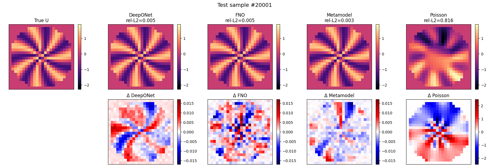
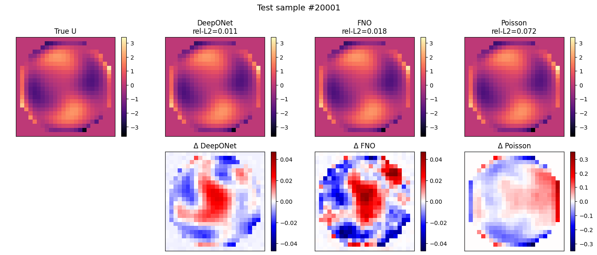

# Wavefront Reconstruction with DeepONet, FNO, and Multi-Stage Operator Learning

This repository is an experimental project for reconstructing two-dimensional wavefronts from sparse slope measurements.

The input is a set of discrete wavefront gradients,

```text
dU/dx, dU/dy
```

measured at sensor positions. The target is the corresponding wavefront field `U(x, y)` on a regular grid inside a circular pupil.

The project explores several reconstruction approaches:

* DeepONet for mapping sparse sensor gradients to regular gradient fields;
* Fourier Neural Operators (FNO) for reconstructing wavefronts from gradient maps;
* a classical Poisson reconstruction baseline;
* two-stage DeepONet + randomly initialized FNO training;
* three-stage DeepONet + FNO training with end-to-end joint fine-tuning;
* sequential benchmark evaluation designed to reduce accelerator-memory usage.

---

## Project Status

> **Work in progress — this is not yet a fully runnable release.**

The project is currently being refactored from a notebook-based workflow into a modular Python package.

The code structure, YAML configurations, CLI entry points, dataset artifacts, training pipelines, inference utilities, and benchmark utilities have been migrated into the repository. However:

* `requirements.txt` has **not yet been updated** for the new package structure and current dependencies;
* the installation workflow is not finalized;
* end-to-end execution of every command has not yet been validated from a clean environment;
* the repository should currently be treated as a development snapshot rather than a reproducible release.

The source code and experiment organization are available for inspection, but successful execution may require manual dependency installation and local configuration adjustments.

---

## Example Results

The figures below show earlier synthetic reconstruction examples comparing
DeepONet, FNO, and the classical Poisson baseline.

### Sensor-gradient input example

<p align="center">
  
</p>

<p align="center">
  <em>
    Figure 1. Reconstruction example using sparse sensor-gradient input.
    DeepONet and FNO closely match the target wavefront, while the Poisson
    baseline has a substantially larger reconstruction error.
  </em>
</p>

For the shown sample:

| Method | Relative L2 error |
|---|---:|
| DeepONet | 0.005 |
| FNO | 0.005 |
| Poisson baseline | 0.525 |

### Regular-grid gradient input example

<p align="center">
  
</p>

<p align="center">
  <em>
    Figure 2. Reconstruction example using regular-grid gradient input.
    This mode evaluates reconstruction when gradient values are available on
    the full spatial grid.
  </em>
</p>

> These figures are illustrative results from earlier synthetic experiments.
> They are not yet a fully reproduced benchmark for the current repository
> state.

## Repository Structure

```text
Wavefront/
├── configs/
│   ├── benchmark.yaml          # Benchmark configuration
│   ├── common.yaml             # Shared training defaults
│   ├── deeponet.yaml           # DeepONet configuration
│   ├── fno.yaml                # FNO configuration
│   ├── standalone_data.yaml    # Synthetic dataset configuration
│   ├── two_stage.yaml          # Two-stage pipeline configuration
│   └── three_stage.yaml        # Three-stage pipeline configuration
│
├── scripts/
│   ├── generate_dataset.py     # Generate a portable synthetic dataset artifact
│   ├── train_deeponet.py       # Train a standalone DeepONet model
│   ├── train_fno.py            # Train a standalone FNO model
│   ├── train_two_stage.py      # Train the two-stage baseline
│   ├── train_three_stage.py    # Train the three-stage model
│   ├── run_benchmark.py        # Run sequential model comparison
│   ├── predict_fno.py          # FNO inference from measurement CSV files
│   ├── predict_two_stage.py    # Two-stage inference from measurement CSV files
│   └── predict_three_stage.py  # Three-stage inference from measurement CSV files
│
├── src/
│   ├── physics/                # Physics-related utilities
│   │
│   └── wavefront/
│       ├── baselines/          # Classical Poisson reconstruction baseline
│       ├── data/               # Data generation, artifacts, interpolation, batching
│       ├── evaluation/         # Metrics, reports, timing, and visualization
│       ├── inference/          # CSV loading and saved-model inference
│       ├── metamodel/          # Gradient-map, Stage 2, and joint-training logic
│       ├── models/             # DeepONet and FNO architectures
│       ├── pipelines/          # Two-stage and three-stage orchestration
│       ├── training/           # Optimizers, losses, trainers, and CLI helpers
│       ├── __init__.py
│       └── config.py
│
├── images/
│   ├── sensor_s1.png          # Example reconstruction comparison
│   └── regular_z1.png
│
├── requirements.txt            # Not yet updated for the current project state
└── README.md
```

---

## Data Generation

Synthetic wavefront datasets can contain a mixture of several wavefront families.

### Zernike wavefronts

Wavefronts are generated as combinations of Zernike modes on the unit disk. This family represents smooth optical aberrations such as defocus, astigmatism, coma, and higher-order distortions.

### Spiral wavefronts

Spiral-like phase patterns are generated using radial and angular phase terms. These samples contain structured rotating features and are useful for testing reconstruction of more complex phase patterns.

### Distortion wavefronts

Atmosphere-like distortions are generated from filtered random fields. A low-pass Butterworth filter and optional Gaussian blur control the spatial smoothness of the resulting wavefront.

### Sensor gradients

For each synthetic wavefront, the project computes gradient measurements:

```text
g_x = dU/dx
g_y = dU/dy
```

The gradient values are sampled at discrete sensor positions and used as the input to DeepONet and the multi-stage pipelines.

---

## Input Modes

The project supports two gradient-input representations.

### `sensor` mode

In `sensor` mode, the input consists of sparse gradient measurements at fixed
sensor locations:

```text
(B, P_sensor, 2)
```


where:

- B is the batch size;
- P_sensor is the number of sensors;
- the last dimension stores:

`[dU/dx, dU/dy]`

This mode represents the practical case where slope measurements are available
only at discrete sensor positions.

DeepONet uses sparse sensor gradients directly. In FNO-based workflows, sparse
measurements are first converted into a regular-grid gradient representation by
interpolation or by the Stage-1 DeepONet gradient-map model.


### regular_grid mode

In regular_grid mode, the input is a dense gradient field on the reconstruction
grid:

```text
(B, H, W, 2)
```

or an equivalent flattened representation:

```text
(B, H * W, 2)
```

where H and W are the spatial grid dimensions.

This mode is used when regular-grid gradients are already available or when
they have been reconstructed from sparse sensor measurements. FNO operates on
regular-grid gradient fields to predict the final wavefront.


---

## Model Overview

### DeepONet

DeepONet receives sparse sensor-gradient measurements and predicts a dense regular-grid gradient field.
DeepONet supports both `sensor` and `regular_grid` input modes. In the main
multi-stage workflow, it receives sparse sensor gradients and predicts a dense
regular-grid gradient field.

```text
Sparse sensor gradients
        ↓
     DeepONet
        ↓
Regular-grid gradient map
```

### FNO

The Fourier Neural Operator receives a dense gradient map and predicts the wavefront field.
FNO operates on regular-grid gradient fields. When the original measurements
are sparse, the required regular-grid input is produced by interpolation or by
the Stage-1 DeepONet gradient-map model.

```text
Regular-grid gradient map
        ↓
        FNO
        ↓
Wavefront reconstruction
```

### Two-stage baseline

The two-stage baseline combines:

```text
Sparse gradients
    ↓
DeepONet
    ↓
Predicted gradient grid
    ↓
Randomly initialized FNO
    ↓
Joint end-to-end optimization
    ↓
Wavefront
```

### Three-stage model

The three-stage pipeline separates gradient reconstruction, FNO training, and final joint fine-tuning.

```text
Stage 1:
Sparse sensor gradients → DeepONet → clean gradient grid

Stage 2:
DeepONet gradient predictions → FNO → wavefront

Stage 3:
DeepONet + FNO → joint fine-tuning using wavefront reconstruction loss
```

---

## Dataset Artifacts

The intended dataset format is a portable artifact directory:

```text
datasets/<dataset_name>/
├── arrays.npz
├── generation_config.yaml
├── metadata.json
└── sensor_layout.csv
```

This format is intended to allow the same fixed dataset, train/test split, and sensor layout to be reused across:

* standalone DeepONet training;
* standalone FNO training;
* two-stage training;
* three-stage training;
* benchmark evaluation.

The artifact workflow is present in the codebase but has not yet been validated as a complete clean-environment workflow.

---

## Intended Command-Line Workflow

The repository contains command-line entry points for the intended workflow:

```bash
python scripts/generate_dataset.py
python scripts/train_deeponet.py
python scripts/train_fno.py
python scripts/train_two_stage.py
python scripts/train_three_stage.py
python scripts/run_benchmark.py
```

Inference entry points are also included:

```bash
python scripts/predict_fno.py
python scripts/predict_two_stage.py
python scripts/predict_three_stage.py
```

> These commands describe the intended interface. They are not yet guaranteed to work end-to-end until dependencies, installation instructions, and the remaining integration checks are finalized.

---

## Current Limitations

* The dependency list in `requirements.txt` is outdated.
* The project is not yet packaged as a finalized installable release.
* Full clean-environment reproducibility has not yet been verified.
* Training and inference commands may require manual environment setup.
* The provided reconstruction figure is an earlier experimental result, not a current automated regression benchmark.
* Dataset, checkpoint, and accelerator-specific workflows are still being finalized.
* The two input modes, `sensor` and `regular_grid`, are represented in the
  codebase, but their complete end-to-end workflows have not yet been
  validated from a clean installation.

---

## Development Direction

The current refactoring focuses on:

1. separating notebook logic into reusable modules;
2. making training and inference scripts independent of notebook state;
3. saving reproducible dataset artifacts;
4. supporting sequential model loading to reduce accelerator-memory pressure;
5. preparing a clean public repository structure;
6. updating dependencies, installation instructions, and validation workflows.

---

## Original Workflow

The project originally began as a notebook-oriented DeepONet reconstruction workflow. The current repository reorganizes that work into modular components while preserving the main scientific goal:

```text
Sparse slope measurements
        ↓
Operator learning
        ↓
Wavefront reconstruction
```
